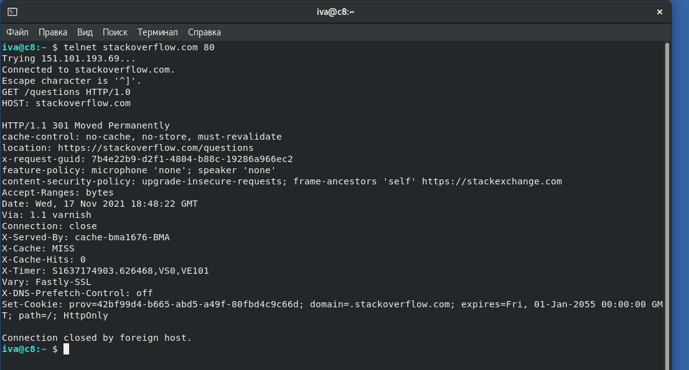
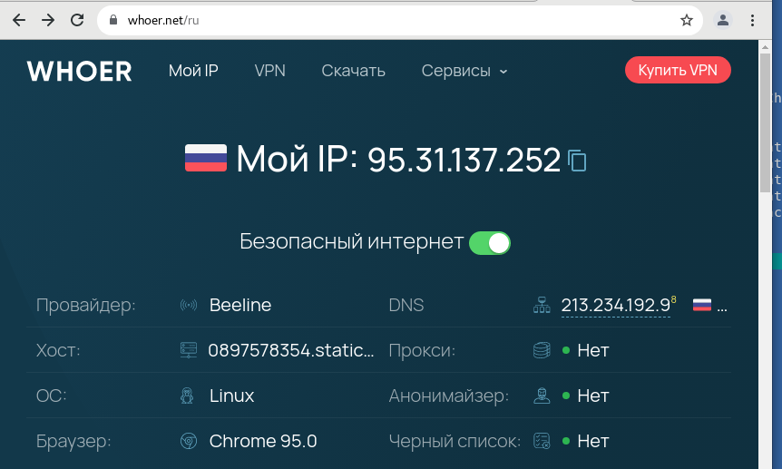

# Домашнее задание к занятию "3.6. Компьютерные сети, лекция 1"

1. Работа c HTTP через телнет.
- Подключитесь утилитой телнет к сайту stackoverflow.com
`telnet stackoverflow.com 80`
- отправьте HTTP запрос
```bash
GET /questions HTTP/1.0
HOST: stackoverflow.com
[press enter]
[press enter]
```
- В ответе укажите полученный HTTP код, что он означает?

```bash
iva@c8:~ $ telnet stackoverflow.com 80
Trying 151.101.193.69...
Connected to stackoverflow.com.
Escape character is '^]'.
GET /questions HTTP/1.0
HOST: stackoverflow.com

HTTP/1.1 301 Moved Permanently
cache-control: no-cache, no-store, must-revalidate
location: https://stackoverflow.com/questions
x-request-guid: 7b4e22b9-d2f1-4804-b88c-19286a966ec2
feature-policy: microphone 'none'; speaker 'none'
content-security-policy: upgrade-insecure-requests; frame-ancestors 'self' https://stackexchange.com
Accept-Ranges: bytes
Date: Wed, 17 Nov 2021 18:48:22 GMT
Via: 1.1 varnish
Connection: close
X-Served-By: cache-bma1676-BMA
X-Cache: MISS
X-Cache-Hits: 0
X-Timer: S1637174903.626468,VS0,VE101
Vary: Fastly-SSL
X-DNS-Prefetch-Control: off
Set-Cookie: prov=42bf99d4-b665-abd5-a49f-80fbd4c9c66d; domain=.stackoverflow.com; expires=Fri, 01-Jan-2055 00:00:00 GMT; path=/; HttpOnly

Connection closed by foreign host.

```

В случае обращения к сайту с использованием telnet возвращается 301 редирект на https ниже скриншот запроса.




2. Повторите задание 1 в браузере, используя консоль разработчика F12.
- откройте вкладку `Network`
- отправьте запрос http://stackoverflow.com
- найдите первый ответ HTTP сервера, откройте вкладку `Headers` - скрин ниже, для задания 1 и 2.
- укажите в ответе полученный HTTP код. 
307 - редирект на https с указанием целевой страницы
- проверьте время загрузки страницы, какой запрос обрабатывался дольше всего? -
Дольше всего обрабатывался запрос на загрузку страницы, т.е. запрос вызываемый при переходе на целевую страницу (Третий скрин).
- приложите скриншот консоли браузера в ответ.


3. Какой IP адрес у вас в интернете?

95.31.137.252 - ниже скрин сайта whoer.net




4. Какому провайдеру принадлежит ваш IP адрес? Какой автономной системе AS? Воспользуйтесь утилитой `whois` 

```bash
route:          95.31.137.0/24
descr:          RU-CORBINA-BROADBAND-POOL2
origin:         AS8402
mnt-by:         RU-CORBINA-MNT
created:        2011-09-16T23:52:14Z
last-modified:  2011-09-16T23:52:14Z
source:         RIPE # Filtered
```

5. Через какие сети проходит пакет, отправленный с вашего компьютера на адрес 8.8.8.8? Через какие AS? Воспользуйтесь утилитой `traceroute`

проходит через две AS - Биллайн(Corbina) AS8402  и Google (AS15169)

```bash
iva@c8:~/Documents/netology/devops-netology/3_6_1  (3.6.1 *)$ traceroute 8.8.8.8
traceroute to 8.8.8.8 (8.8.8.8), 30 hops max, 60 byte packets
 1  _gateway (192.168.1.1)  0.672 ms  0.735 ms  0.861 ms
 2  95.31.0.1 (95.31.0.1)  2.764 ms  7.762 ms  7.746 ms
 3  78.107.15.1 (78.107.15.1)  7.735 ms  7.724 ms  7.712 ms
 4  10.2.254.178 (10.2.254.178)  7.784 ms  7.788 ms  7.777 ms
 5  m9-crs-be3.corbina.net (195.14.54.141)  7.774 ms  7.763 ms  7.761 ms
 6  * 213.234.224.137 (213.234.224.137)  5.069 ms *
 7  213.234.224.132 (213.234.224.132)  4.413 ms * 72.14.198.182 (72.14.198.182)  9.253 ms

 8  85.21.224.191 (85.21.224.191)  4.270 ms *  4.256 ms
 9  * * 108.170.250.99 (108.170.250.99)  9.206 ms
10  108.170.250.130 (108.170.250.130)  9.146 ms 108.170.250.129 (108.170.250.129)  9.179 ms 108.170.250.83 (108.170.250.83)  39.379 ms
11  142.251.49.24 (142.251.49.24)  19.272 ms 209.85.255.136 (209.85.255.136)  20.846 ms 172.253.65.82 (172.253.65.82)  15.821 ms
12  216.239.42.23 (216.239.42.23)  25.850 ms 172.253.64.55 (172.253.64.55)  22.355 ms 72.14.235.69 (72.14.235.69)  22.334 ms
13  * * 108.170.232.251 (108.170.232.251)  25.462 ms
14  * * 142.250.56.13 (142.250.56.13)  20.317 ms
15  * * *
16  * * *
17  * * *
18  * * *
19  * * *
20  dns.google (8.8.8.8)  18.016 ms * *
```

6. Повторите задание 5 в утилите `mtr`. На каком участке наибольшая задержка - delay?
    наибольшие потери наблюдаются в AS15169 (Google)   10. AS15169  142.251.49.78       40.0%    10   19.6  19.3  19.1  19.6   0.2


```bash
iva@c8:~/Documents/netology/devops-netology/3_6_1  (3.6.1 *)$ mtr 8.8.8.8 -z -b -r
Start: 2021-11-19T01:52:59+0300
HOST: c8.localdomain              Loss%   Snt   Last   Avg  Best  Wrst StDev
  1. AS???    _gateway (192.168.1  0.0%    10    0.6   0.6   0.5   0.8   0.1
  2. AS8402   95.31.0.1            0.0%    10    1.1   1.1   1.0   1.2   0.1
  3. AS8402   78.107.15.1          0.0%    10    1.0   1.1   1.0   1.2   0.1
  4. AS???    10.2.254.178         0.0%    10    1.2   1.2   1.1   1.4   0.1
  5. AS8402   m9-crs-be3.corbina. 10.0%    10    2.0   2.1   2.0   2.3   0.1
  6. AS8402   213.234.224.137      0.0%    10    2.8   2.7   2.6   2.9   0.1
  7. AS8402   213.234.224.132      0.0%    10    2.6   2.8   2.6   3.3   0.2
  8. AS8402   85.21.224.191        0.0%    10    2.7   2.7   2.6   2.9   0.1
  9. AS15169  108.170.250.66       0.0%    10    4.0   4.0   3.8   4.2   0.1
 10. AS15169  142.251.49.78       40.0%    10   19.6  19.3  19.1  19.6   0.2
 11. AS15169  72.14.235.69         0.0%    10   15.8  15.7  15.6  15.9   0.1
 12. AS15169  172.253.51.237       0.0%    10   18.3  18.8  18.2  19.6   0.6
 13. AS???    ???                 100.0    10    0.0   0.0   0.0   0.0   0.0
 14. AS???    ???                 100.0    10    0.0   0.0   0.0   0.0   0.0
 15. AS???    ???                 100.0    10    0.0   0.0   0.0   0.0   0.0
 16. AS???    ???                 100.0    10    0.0   0.0   0.0   0.0   0.0
 17. AS???    ???                 100.0    10    0.0   0.0   0.0   0.0   0.0
 18. AS???    ???                 100.0    10    0.0   0.0   0.0   0.0   0.0
 19. AS???    ???                 100.0    10    0.0   0.0   0.0   0.0   0.0
 20. AS???    ???                 100.0    10    0.0   0.0   0.0   0.0   0.0
 21. AS???    ???                 100.0    10    0.0   0.0   0.0   0.0   0.0
 22. AS15169  dns.google (8.8.8.8 10.0%    10   17.7  17.7  17.5  17.9   0.1
```

7. Какие DNS сервера отвечают за доменное имя dns.google? Какие A записи? воспользуйтесь утилитой `dig`

```bash
iva@c8:~/Documents/netology/devops-netology/3_6_1  (3.6.1 *)$ dig +trace @8.8.8.8 dns.google |grep dns
; <<>> DiG 9.11.26-RedHat-9.11.26-4.el8_4 <<>> +trace @8.8.8.8 dns.google
dns.google.		10800	IN	NS	ns1.zdns.google.
dns.google.		10800	IN	NS	ns2.zdns.google.
dns.google.		10800	IN	NS	ns4.zdns.google.
dns.google.		10800	IN	NS	ns3.zdns.google.
dns.google.		3600	IN	DS	56044 8 2 1B0A7E90AA6B1AC65AA5B573EFC44ABF6CB2559444251B997103D2E4 0C351B08
dns.google.		3600	IN	RRSIG	DS 8 2 3600 20211209000308 20211117000308 8830 google. 7fV/3ABie9BAIZoKyvOSaHdhShqvVe7Q966vlOIc5H2xT2SBliZ8MDQX DGDLlWJiz/3VkUkyfLsKHDiaWIPv7iUIcnmzS3/Gz0gwRRiOs1r6sEzU B4SsKtTfw3fPmu3qhsWEFOpXcuM0UNko47gJYkEBuKJSM35Z0lCRhcw3 zkk=
dns.google.		900	IN	A	8.8.8.8
dns.google.		900	IN	A	8.8.4.4
dns.google.		900	IN	RRSIG	A 8 2 900 20211218160930 20211118160930 1773 dns.google. BxWCV4eVJQtBSOpEBDhyDkdhqJaJPFYF8EMn/CVasAPsqfupmMNSukc6 8WsQWL4SBcywkTTFTQbkmTcXjJAdGFalZMSUtm96U6aYPtut1iCa8YpJ 56ODIqSX1sKHCrgIBsYrrN/KM5Eg7uZAQIBpBl2NYb/KqxiwsfF5QSnS 7O0=
;; Received 241 bytes from 216.239.32.114#53(ns1.zdns.google) in 51 ms
```

8. Проверьте PTR записи для IP адресов из задания 7. Какое доменное имя привязано к IP? воспользуйтесь утилитой `dig`

```bash
iva@c8:~/Documents/netology/devops-netology/3_6_1  (3.6.1 *)$ dig +trace @8.8.8.8 dns.google |grep dns
; <<>> DiG 9.11.26-RedHat-9.11.26-4.el8_4 <<>> +trace @8.8.8.8 dns.google
dns.google.		10800	IN	NS	ns3.zdns.google.
dns.google.		10800	IN	NS	ns1.zdns.google.
dns.google.		10800	IN	NS	ns2.zdns.google.
dns.google.		10800	IN	NS	ns4.zdns.google.
dns.google.		3600	IN	DS	56044 8 2 1B0A7E90AA6B1AC65AA5B573EFC44ABF6CB2559444251B997103D2E4 0C351B08
dns.google.		3600	IN	RRSIG	DS 8 2 3600 20211209000308 20211117000308 8830 google. 7fV/3ABie9BAIZoKyvOSaHdhShqvVe7Q966vlOIc5H2xT2SBliZ8MDQX DGDLlWJiz/3VkUkyfLsKHDiaWIPv7iUIcnmzS3/Gz0gwRRiOs1r6sEzU B4SsKtTfw3fPmu3qhsWEFOpXcuM0UNko47gJYkEBuKJSM35Z0lCRhcw3 zkk=
dns.google.		900	IN	A	8.8.8.8
dns.google.		900	IN	A	8.8.4.4
dns.google.		900	IN	RRSIG	A 8 2 900 20211218160930 20211118160930 1773 dns.google. BxWCV4eVJQtBSOpEBDhyDkdhqJaJPFYF8EMn/CVasAPsqfupmMNSukc6 8WsQWL4SBcywkTTFTQbkmTcXjJAdGFalZMSUtm96U6aYPtut1iCa8YpJ 56ODIqSX1sKHCrgIBsYrrN/KM5Eg7uZAQIBpBl2NYb/KqxiwsfF5QSnS 7O0=
;; Received 241 bytes from 216.239.34.114#53(ns2.zdns.google) in 50 ms
iva@c8:~/Documents/netology/devops-netology/3_6_1  (3.6.1 *)$ dig -x 8.8.8.8 

; <<>> DiG 9.11.26-RedHat-9.11.26-4.el8_4 <<>> -x 8.8.8.8
;; global options: +cmd
;; Got answer:
;; ->>HEADER<<- opcode: QUERY, status: NOERROR, id: 25592
;; flags: qr rd ra; QUERY: 1, ANSWER: 1, AUTHORITY: 0, ADDITIONAL: 1

;; OPT PSEUDOSECTION:
; EDNS: version: 0, flags:; udp: 4096
;; QUESTION SECTION:
;8.8.8.8.in-addr.arpa.		IN	PTR

;; ANSWER SECTION:
8.8.8.8.in-addr.arpa.	18406	IN	PTR	dns.google.

;; Query time: 1 msec
;; SERVER: 192.168.1.1#53(192.168.1.1)
;; WHEN: Пт ноя 19 02:17:37 MSK 2021
;; MSG SIZE  rcvd: 73

iva@c8:~/Documents/netology/devops-netology/3_6_1  (3.6.1 *)$ dig -x 8.8.4.4

; <<>> DiG 9.11.26-RedHat-9.11.26-4.el8_4 <<>> -x 8.8.4.4
;; global options: +cmd
;; Got answer:
;; ->>HEADER<<- opcode: QUERY, status: NOERROR, id: 12229
;; flags: qr rd ra; QUERY: 1, ANSWER: 1, AUTHORITY: 0, ADDITIONAL: 1

;; OPT PSEUDOSECTION:
; EDNS: version: 0, flags:; udp: 4096
;; QUESTION SECTION:
;4.4.8.8.in-addr.arpa.		IN	PTR

;; ANSWER SECTION:
4.4.8.8.in-addr.arpa.	78061	IN	PTR	dns.google.

;; Query time: 3 msec
;; SERVER: 192.168.1.1#53(192.168.1.1)
;; WHEN: Пт ноя 19 02:17:44 MSK 2021
;; MSG SIZE  rcvd: 73
```
