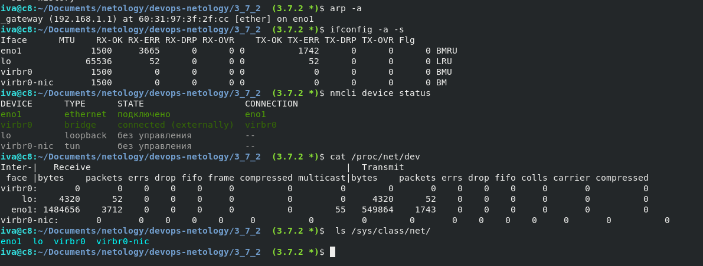

# Домашнее задание к занятию "3.7. Компьютерные сети, лекция 2"

1. Проверьте список доступных сетевых интерфейсов на вашем компьютере. Какие команды есть для этого в Linux и в Windows?

В Linux доступны следующие команды: ifconfig, ip, в Windows это ipconfig. ниже список доступных интервейсов eno1 - физическая сетевая карта, lo - интерфейс обратной петли (local loopback) - позволяет компьютеру обращатся к самому себе, 
virb0 - интерфейс виртулальной сетевой карты (бридж) - для взаимодействия с виртуальными хостами.

Комманды для linux:
```
iva@c8:~ $ip -br a
iva@c8:~ $ifconfig -a -s
iva@c8:~ $nmcli device status 
iva@c8:~ $cat /proc/net/dev
iva@c8:~ $ls /sys/class/net/

```




```bash
iva@c8:~/Documents/netology/devops-netology/3_7_2  (3.7.2)$ ifconfig 
eno1: flags=4163<UP,BROADCAST,RUNNING,MULTICAST>  mtu 1500
        inet 192.168.1.17  netmask 255.255.255.0  broadcast 192.168.1.255
        inet6 fe80::5246:5dff:fe6f:2f14  prefixlen 64  scopeid 0x20<link>
        ether 50:46:5d:6f:2f:14  txqueuelen 1000  (Ethernet)
        RX packets 113558  bytes 96443768 (91.9 MiB)
        RX errors 0  dropped 106  overruns 0  frame 0
        TX packets 51649  bytes 17276961 (16.4 MiB)
        TX errors 0  dropped 0 overruns 0  carrier 0  collisions 0
        device interrupt 20  memory 0xf7100000-f7120000  

lo: flags=73<UP,LOOPBACK,RUNNING>  mtu 65536
        inet 127.0.0.1  netmask 255.0.0.0
        inet6 ::1  prefixlen 128  scopeid 0x10<host>
        loop  txqueuelen 1000  (Local Loopback)
        RX packets 98  bytes 6114 (5.9 KiB)
        RX errors 0  dropped 0  overruns 0  frame 0
        TX packets 98  bytes 6114 (5.9 KiB)
        TX errors 0  dropped 0 overruns 0  carrier 0  collisions 0

virbr0: flags=4099<UP,BROADCAST,MULTICAST>  mtu 1500
        inet 192.168.122.1  netmask 255.255.255.0  broadcast 192.168.122.255
        ether 52:54:00:dc:4e:6d  txqueuelen 1000  (Ethernet)
        RX packets 0  bytes 0 (0.0 B)
        RX errors 0  dropped 0  overruns 0  frame 0
        TX packets 0  bytes 0 (0.0 B)
        TX errors 0  dropped 0 overruns 0  carrier 0  collisions 0
```

команды для Windows: ipconfig, либо с помощь. powerShell и команды Get-NetAdapter, так же возможно получить некоторую информацию об интерфейсах с помощью netsh


2. Какой протокол используется для распознавания соседа по сетевому интерфейсу? Какой пакет и команды есть в Linux для этого?

LLDP
Link Layer Discovery Protocol (LLDP) — протокол канального уровня, позволяющий сетевому оборудованию оповещать оборудование, работающее в локальной сети, о своём существовании и передавать ему свои характеристики, а также получать от него аналогичные сведения. 

так же на равне с данным протоколом используются следующи:

для IPv4 - ARP (Address Resolution Protocol) - для определения IP по MAC-адресу, IRDP (Internet Router Discovery Protocol или ICMP Router Discovery Protocol) или RDISC (от англ. Router Discovery — обнаружение маршрутизаторов) — протокол для компьютерных хостов для обнаружения присутствия и расположения маршрутизаторов в их локальной сети IPv4.

для IPv6 - NDP (Neighbor Discovery Protocol (NDP, ND)) - протокол обнаружения соседей 


3. Какая технология используется для разделения L2 коммутатора на несколько виртуальных сетей? Какой пакет и команды есть в Linux для этого? Приведите пример конфига.

VLAN

пример конфига настройки vlan в Centos 


Примеры файлов:

сетевой интерфейс

```
/etc/sysconfig/network-scripts/ifcfg-eth0.10

   VLAN=yes
   DEVICE=eth0.10
   BOOTPROTO=static
   ONBOOT=yes
   TYPE=Ethernet
   IPADDR=10.10.10.2
   NETMASK=255.255.255.252
```

VLAN:

/etc/sysconfig/network-scripts/ifcfg-vlan10

```
   VLAN=yes
   VLAN_NAME_TYPE=VLAN_PLUS_VID_NO_PAD
   DEVICE=vlan10
   PHYSDEV=eth0
   BOOTPROTO=static
   ONBOOT=yes
   TYPE=Ethernet
   IPADDR=10.10.10.2
   NETMASK=255.255.255.252
```

4. Какие типы агрегации интерфейсов есть в Linux? Какие опции есть для балансировки нагрузки? Приведите пример конфига.

Типы агрегации:

Mode-0(balance-rr) – Данный режим используется по умолчанию. Balance-rr обеспечивается балансировку нагрузки и отказоустойчивость. В данном режиме сетевые пакеты отправляются “по кругу”, от первого интерфейса к последнему. Если выходят из строя интерфейсы, пакеты отправляются на остальные оставшиеся. Дополнительной настройки коммутатора не требуется при нахождении портов в одном коммутаторе. При разностных коммутаторах требуется дополнительная настройка.

Mode-1(active-backup) – Один из интерфейсов работает в активном режиме, остальные в ожидающем. При обнаружении проблемы на активном интерфейсе производится переключение на ожидающий интерфейс. Не требуется поддержки от коммутатора.

Mode-2(balance-xor) – Передача пакетов распределяется по типу входящего и исходящего трафика по формуле ((MAC src) XOR (MAC dest)) % число интерфейсов. Режим дает балансировку нагрузки и отказоустойчивость. Не требуется дополнительной настройки коммутатора/коммутаторов.

Mode-3(broadcast) – Происходит передача во все объединенные интерфейсы, тем самым обеспечивая отказоустойчивость. Рекомендуется только для использования MULTICAST трафика.

Mode-4(802.3ad) – динамическое объединение одинаковых портов. В данном режиме можно значительно увеличить пропускную способность входящего так и исходящего трафика. Для данного режима необходима поддержка и настройка коммутатора/коммутаторов.

Mode-5(balance-tlb) – Адаптивная балансировки нагрузки трафика. Входящий трафик получается только активным интерфейсом, исходящий распределяется в зависимости от текущей загрузки канала каждого интерфейса. Не требуется специальной поддержки и настройки коммутатора/коммутаторов.

Mode-6(balance-alb) – Адаптивная балансировка нагрузки. Отличается более совершенным алгоритмом балансировки нагрузки чем Mode-5). Обеспечивается балансировку нагрузки как исходящего так и входящего трафика. Не требуется специальной поддержки и настройки коммутатора/коммутаторов.


Получить информацию о всех возможных опциях BONDING_OPTS и вариантах их значений можно в документе Using Channel Bonding (https://access.redhat.com/documentation/en-us/red_hat_enterprise_linux/7/html/networking_guide/sec-using_channel_bonding).

Пример конфига в котором в качестве опции указан тип балансировки active-backup, интервал опроса 100 милисекунд - Определяет, как часто происходит мониторинг канала MII. Это полезно, если требуется высокая доступность, используется для проверки активности сетевой карты.

The contents of the ifcfg-bondX file is as follows:

```
BOOTPROTO="static"
BROADCAST="10.0.2.255"
IPADDR="10.0.2.10"
NETMASK="255.255.0.0"
NETWORK="10.0.2.0"
REMOTE_IPADDR=""
STARTMODE="onboot"
BONDING_MASTER="yes"
BONDING_MODULE_OPTS="mode=active-backup miimon=100"
BONDING_SLAVE0="eth0"
BONDING_SLAVE1="bus-pci-0000:06:08.1"
```

5. Сколько IP адресов в сети с маской /29 ? Сколько /29 подсетей можно получить из сети с маской /24. Приведите несколько примеров /29 подсетей внутри сети 10.10.10.0/24.

    8 ip адресов из которых 6 для хостов, один широковещательный и один это адрес сети, всего возможно сделать 32 подсети в каждой из которой будет доступно по 6 ip адресов хостов.

```
Адрес	10.10.10.0	0A.0A.0A.00	00001010.00001010.00001010.00000 | 000
Bitmask	29		
Netmask	255.255.255.248	FF.FF.FF.F8	11111111.11111111.11111111.11111 | 000
Wildcard	0.0.0.7	00.00.00.07	00000000.00000000.00000000.00000 | 111
Network	10.10.10.0	0A.0A.0A.00	00001010.00001010.00001010.00000 | 000
Broadcast	10.10.10.7	0A.0A.0A.07	00001010.00001010.00001010.00000 | 111
Hostmin	10.10.10.1	0A.0A.0A.01	00001010.00001010.00001010.00000 | 001
Hostmax	10.10.10.6	0A.0A.0A.06	00001010.00001010.00001010.00000 | 110
Hosts	6
```

```
Адрес	10.10.10.128	0A.0A.0A.80	00001010.00001010.00001010.10000 | 000
Bitmask	29		
Netmask	255.255.255.248	FF.FF.FF.F8	11111111.11111111.11111111.11111 | 000
Wildcard	0.0.0.7	00.00.00.07	00000000.00000000.00000000.00000 | 111
Network	10.10.10.128	0A.0A.0A.80	00001010.00001010.00001010.10000 | 000
Broadcast	10.10.10.135	0A.0A.0A.87	00001010.00001010.00001010.10000 | 111
Hostmin	10.10.10.129	0A.0A.0A.81	00001010.00001010.00001010.10000 | 001
Hostmax	10.10.10.134	0A.0A.0A.86	00001010.00001010.00001010.10000 | 110
Hosts	6		
```


6. Задача: вас попросили организовать стык между 2-мя организациями. Диапазоны 10.0.0.0/8, 172.16.0.0/12, 192.168.0.0/16 уже заняты. Из какой подсети допустимо взять частные IP адреса? Маску выберите из расчета максимум 40-50 хостов внутри подсети.

    100.64.0.0/10 - возможно использовать данную подсеть.

    /26 - 255.255.255.192	 маска из расчёта максимума хостов в сети 

```
IP адрес	100.64.0.0	64.40.00.00	01100100.01000000.00000000.00000000
Префикс маски подсети	/26
Маска подсети	255.255.255.192	FF.FF.FF.C0	11111111.11111111.11111111.11000000
Обратная маска подсети (wildcard mask)	0.0.0.63	00.00.00.3F	00000000.00000000.00000000.00111111
IP адрес сети	100.64.0.0	64.40.00.00	01100100.01000000.00000000.00000000
Широковещательный адрес	100.64.0.63	64.40.00.3F	01100100.01000000.00000000.00111111
IP адрес первого хоста	100.64.0.1	64.40.00.01	01100100.01000000.00000000.00000001
IP адрес последнего хоста	100.64.0.62	64.40.00.3E	01100100.01000000.00000000.00111110
Количество доступных адресов	64
Количество рабочих адресов для хостов	62
```

7. Как проверить ARP таблицу в Linux, Windows? Как очистить ARP кеш полностью? Как из ARP таблицы удалить только один нужный IP?

    проверка в Linux: 

```bash
iva@c8:~ $ ip neigh
192.168.1.1 dev eno1 lladdr 60:31:97:3f:2f:cc DELAY
192.168.1.33 dev eno1 lladdr 9c:da:3e:73:eb:28 STALE
fe80::6231:97ff:fe3f:2fcc dev eno1 lladdr 60:31:97:3f:2f:cc router REACHABLE
iva@c8:~ $ arp -a
_gateway (192.168.1.1) at 60:31:97:3f:2f:cc [ether] on eno1
? (192.168.1.33) at 9c:da:3e:73:eb:28 [ether] on eno1
```
    Проверка в Windows: arp -a

    Полная очистка в linux: ip neigh flush all или arp -d
    Полная очистка в Windows: arp -d

    Только один ip в Linux: arp -d 192.168.1.10 или ip neigh del dev eno1 192.168.10.10
    Только один ip в Windows: arp -d 192.168.1.10
    


 ---
## Задание для самостоятельной отработки (необязательно к выполнению)

 8*. Установите эмулятор EVE-ng.
 
 Инструкция по установке - https://github.com/svmyasnikov/eve-ng

 Выполните задания на lldp, vlan, bonding в эмуляторе EVE-ng. 

в процессе выполнения 
 ---

