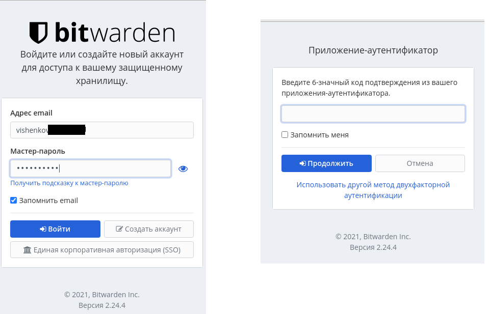
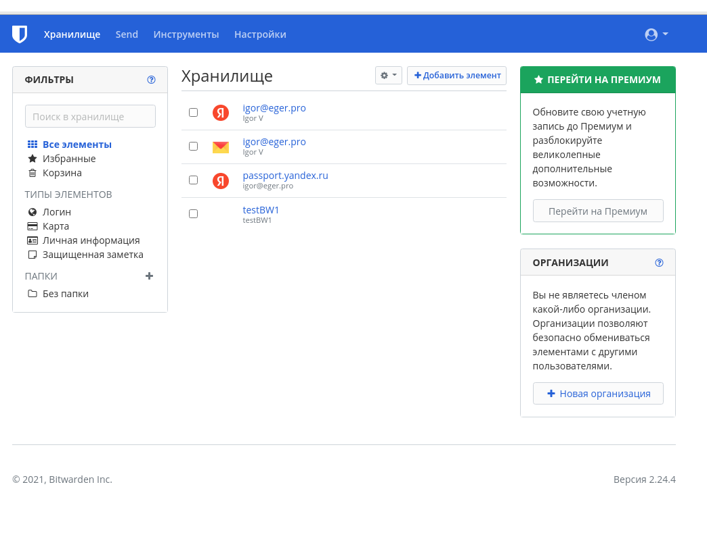
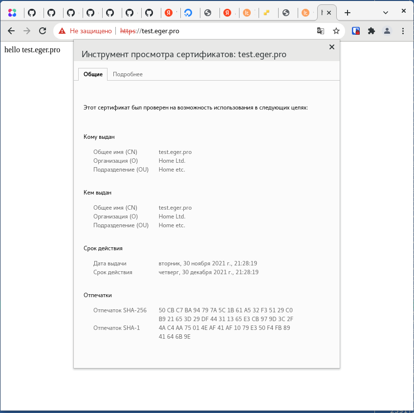
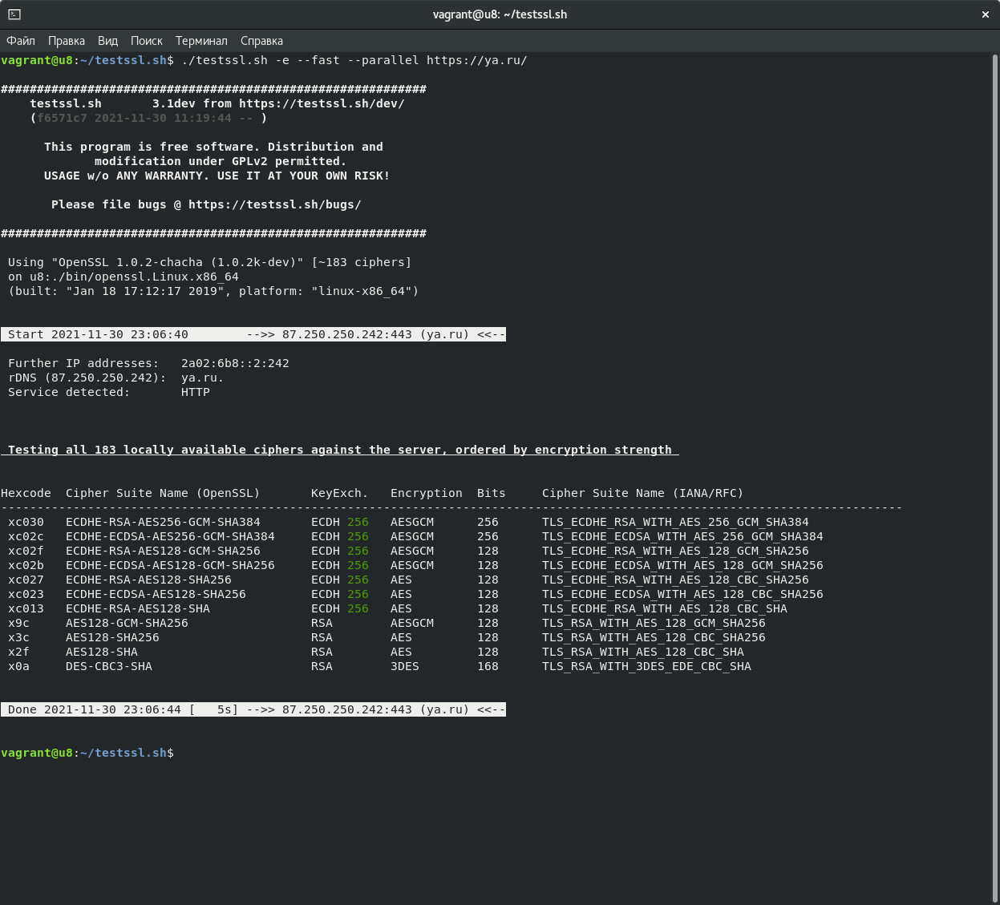
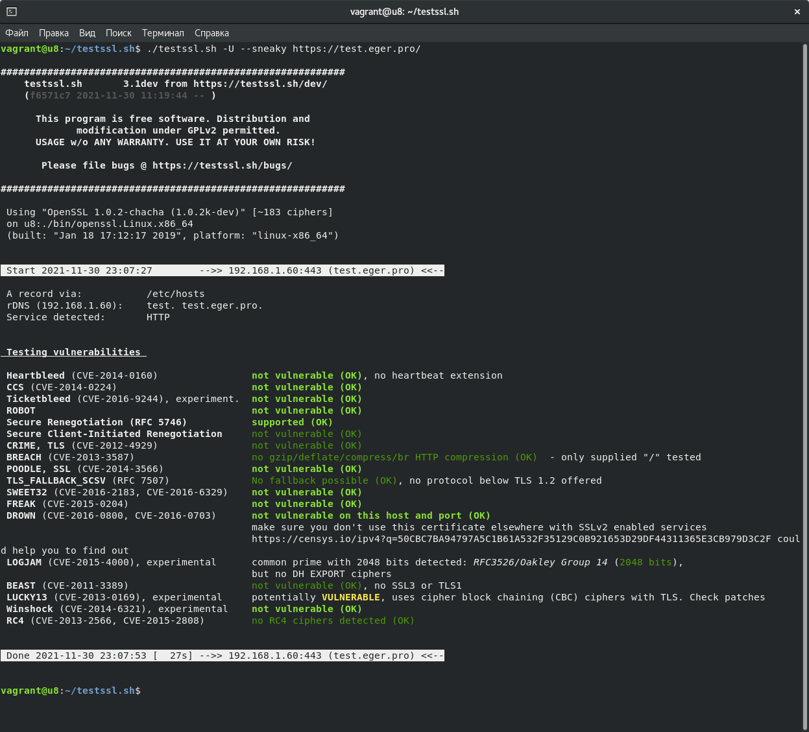
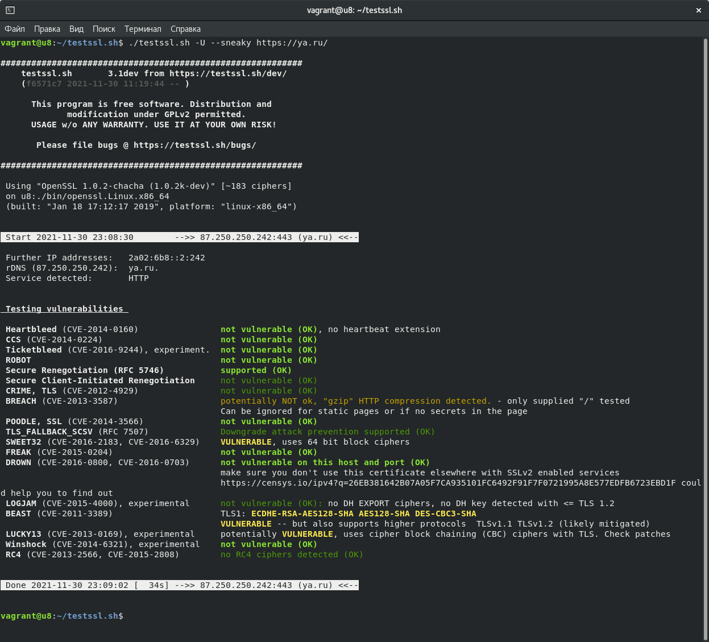
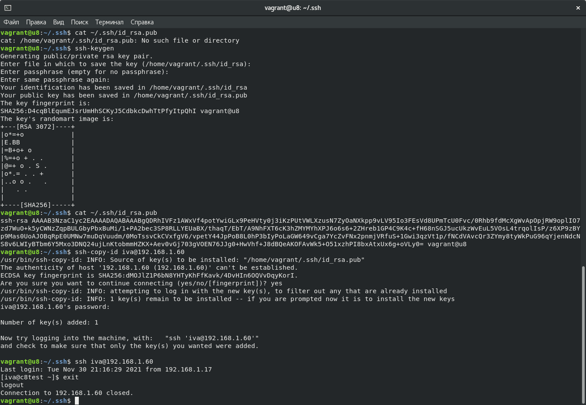
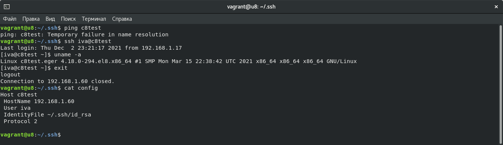

# Домашнее задание к занятию "3.9. Элементы безопасности информационных систем"

1. Установите Bitwarden плагин для браузера. Зарегестрируйтесь и сохраните несколько паролей.


2. Установите Google authenticator на мобильный телефон. Настройте вход в Bitwarden акаунт через Google authenticator OTP.






3. Установите apache2, сгенерируйте самоподписанный сертификат, настройте тестовый сайт для работы по HTTPS.




4. Проверьте на TLS уязвимости произвольный сайт в интернете.









5. Установите на Ubuntu ssh сервер, сгенерируйте новый приватный ключ. Скопируйте свой публичный ключ на другой сервер. Подключитесь к серверу по SSH-ключу.




6. Переименуйте файлы ключей из задания 5. Настройте файл конфигурации SSH клиента, так чтобы вход на удаленный сервер осуществлялся по имени сервера.




7. Соберите дамп трафика утилитой tcpdump в формате pcap, 100 пакетов. Откройте файл pcap в Wireshark.

```bash
iva@c8:~ $ sudo tcpdump -c 100 -i eno1 -w eno1_dump.pcap
dropped privs to tcpdump
tcpdump: listening on eno1, link-type EN10MB (Ethernet), capture size 262144 bytes
100 packets captured
126 packets received by filter
0 packets dropped by kernel
```


 ---
## Задание для самостоятельной отработки (необязательно к выполнению)

8*. Просканируйте хост scanme.nmap.org. Какие сервисы запущены?


22/tcp    open     ssh 

80/tcp    open     http 

9929/tcp  open     nping-echo - эхо порт, настраиваемый nmap

31337/TCP	Back Orifice — средство для удаленного администрирования (часто троянская программа)

9*. Установите и настройте фаервол ufw на web-сервер из задания 3. Откройте доступ снаружи только к портам 22,80,443

в задании 3 использовал centos, в ubuntu настройка файрволла выглядит следующим образом (проброшены другие порты выше 1000, т.к. vagrant не позволяет напрямую мапить 22 порт, 80 и 443):


```bash
vagrant@u8:~$ sudo ufw allow 8080/tcp
Rules updated
Rules updated (v6)
vagrant@u8:~$ sudo ufw allow ssh/tcp
Rules updated
Rules updated (v6)
vagrant@u8:~$ sudo ufw allow 8443/tcp
Rules updated
Rules updated (v6)
vagrant@u8:~$ sudo ufw status
Status: inactive
vagrant@u8:~$ sudo ufw enable
Command may disrupt existing ssh connections. Proceed with operation (y|n)? y
Firewall is active and enabled on system startup
vagrant@u8:~$ sudo ufw status
Status: active

To                         Action      From
--                         ------      ----
8080/tcp                   ALLOW       Anywhere                  
22/tcp                     ALLOW       Anywhere                  
8443/tcp                   ALLOW       Anywhere                  
8080/tcp (v6)              ALLOW       Anywhere (v6)             
22/tcp (v6)                ALLOW       Anywhere (v6)             
8443/tcp (v6)              ALLOW       Anywhere (v6)    
```


 ---

