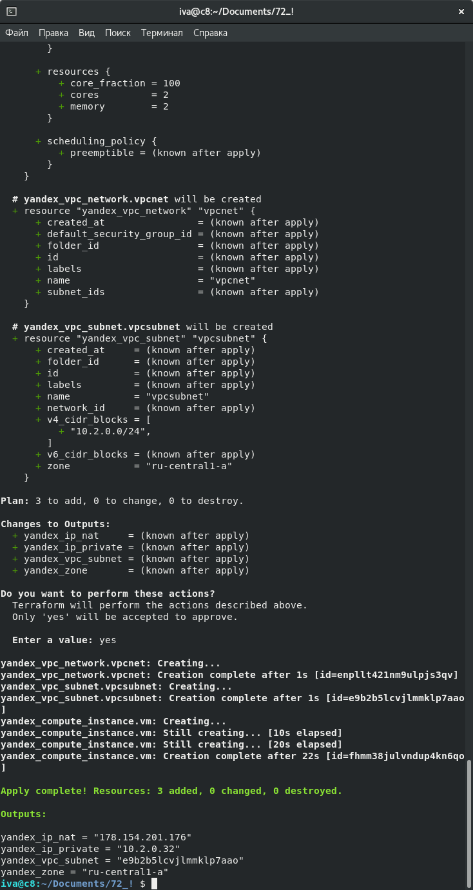
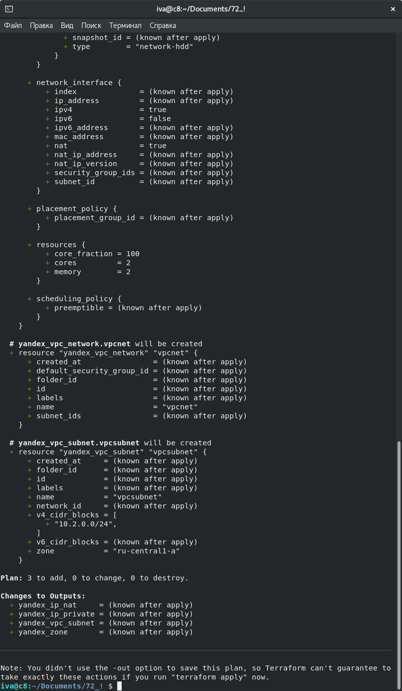
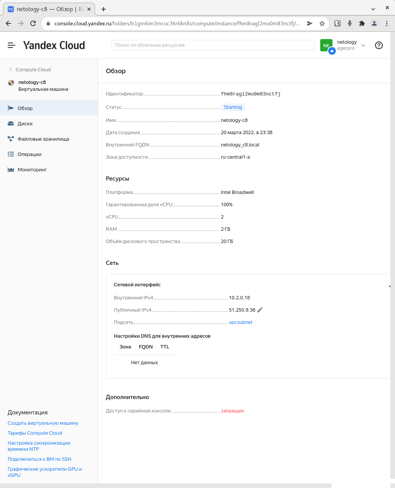

# Домашнее задание к занятию "7.2. Облачные провайдеры и синтаксис Terraform."

Зачастую разбираться в новых инструментах гораздо интересней понимая то, как они работают изнутри. 
Поэтому в рамках первого *необязательного* задания предлагается завести свою учетную запись в AWS (Amazon Web Services) или Yandex.Cloud.
Идеально будет познакомится с обоими облаками, потому что они отличаются. 

## Задача 1 (вариант с AWS). Регистрация в aws и знакомство с основами (необязательно, но крайне желательно).

Остальные задания можно будет выполнять и без этого аккаунта, но с ним можно будет увидеть полный цикл процессов. 

AWS предоставляет достаточно много бесплатных ресурсов в первый год после регистрации, подробно описано [здесь](https://aws.amazon.com/free/).
1. Создайте аккаут aws.
1. Установите c aws-cli https://aws.amazon.com/cli/.
1. Выполните первичную настройку aws-sli https://docs.aws.amazon.com/cli/latest/userguide/cli-configure-quickstart.html.
1. Создайте IAM политику для терраформа c правами
    * AmazonEC2FullAccess
    * AmazonS3FullAccess
    * AmazonDynamoDBFullAccess
    * AmazonRDSFullAccess
    * CloudWatchFullAccess
    * IAMFullAccess
1. Добавьте переменные окружения 
    ```
    export AWS_ACCESS_KEY_ID=(your access key id)
    export AWS_SECRET_ACCESS_KEY=(your secret access key)
    ```
1. Создайте, остановите и удалите ec2 инстанс (любой с пометкой `free tier`) через веб интерфейс. 

В виде результата задания приложите вывод команды `aws configure list`.

## Задача 1 (Вариант с Yandex.Cloud). Регистрация в ЯО и знакомство с основами (необязательно, но крайне желательно).

1. Подробная инструкция на русском языке содержится [здесь](https://cloud.yandex.ru/docs/solutions/infrastructure-management/terraform-quickstart).
2. Обратите внимание на период бесплатного использования после регистрации аккаунта. 
3. Используйте раздел "Подготовьте облако к работе" для регистрации аккаунта. Далее раздел "Настройте провайдер" для подготовки
базового терраформ конфига.
4. Воспользуйтесь [инструкцией](https://registry.terraform.io/providers/yandex-cloud/yandex/latest/docs) на сайте терраформа, что бы 
не указывать авторизационный токен в коде, а терраформ провайдер брал его из переменных окружений.


```bash
iva@c8:~/Documents/k11s-os/infrastructure-as-code/terraform/demo  (main)$ yc config list
token: AQAEA7******************************
cloud-id: b1gos10ashr7cgusvgg9
folder-name: netology
compute-default-zone: ru-central1-a
iva@c8:~/Documents/k11s-os/infrastructure-as-code/terraform/demo  (main)$ yc config set folder-id 'b1gm6im3mcuc36r6kn8s'
iva@c8:~/Documents/k11s-os/infrastructure-as-code/terraform/demo  (main)$ yc config list
token: AQAEA7******************************
cloud-id: b1gos10ashr7cgusvgg9
folder-id: b1gm6im3mcuc36r6kn8s
compute-default-zone: ru-central1-a

iva@c8:~/Documents/netology/devops-netology/DevVirt/07-terraform-02-syntax  (07-terraform-02-syntax *)$ yc resource-manager cloud list
+----------------------+---------+-----------------+
|          ID          |  NAME   | ORGANIZATION ID |
+----------------------+---------+-----------------+
| b1gos10ashr7cgusvgg9 | egerpro |                 |
+----------------------+---------+-----------------+
iva@c8:~/Documents/netology/devops-netology/DevVirt/07-terraform-02-syntax  (07-terraform-02-syntax *)$ yc resource-manager folder list
+----------------------+----------+--------+--------+
|          ID          |   NAME   | LABELS | STATUS |
+----------------------+----------+--------+--------+
| b1gm6im3mcuc36r6kn8s | netology |        | ACTIVE |
+----------------------+----------+--------+--------+

```


## Задача 2. Создание aws ec2 или yandex_compute_instance через терраформ. 

1. В каталоге `terraform` вашего основного репозитория, который был создан в начале курсе, создайте файл `main.tf` и `versions.tf`.
2. Зарегистрируйте провайдер 
   1. для [aws](https://registry.terraform.io/providers/hashicorp/aws/latest/docs). В файл `main.tf` добавьте
   блок `provider`, а в `versions.tf` блок `terraform` с вложенным блоком `required_providers`. Укажите любой выбранный вами регион 
   внутри блока `provider`.
   2. либо для [yandex.cloud](https://registry.terraform.io/providers/yandex-cloud/yandex/latest/docs). Подробную инструкцию можно найти 
   [здесь](https://cloud.yandex.ru/docs/solutions/infrastructure-management/terraform-quickstart).
3. Внимание! В гит репозиторий нельзя пушить ваши личные ключи доступа к аккаунту. Поэтому в предыдущем задании мы указывали
их в виде переменных окружения. 
4. В файле `main.tf` воспользуйтесь блоком `data "aws_ami` для поиска ami образа последнего Ubuntu.  
5. В файле `main.tf` создайте рессурс 
   1. либо [ec2 instance](https://registry.terraform.io/providers/hashicorp/aws/latest/docs/resources/instance).
   Постарайтесь указать как можно больше параметров для его определения. Минимальный набор параметров указан в первом блоке 
   `Example Usage`, но желательно, указать большее количество параметров.
   2. либо [yandex_compute_image](https://registry.terraform.io/providers/yandex-cloud/yandex/latest/docs/resources/compute_image).
6. Также в случае использования aws:
   1. Добавьте data-блоки `aws_caller_identity` и `aws_region`.
   2. В файл `outputs.tf` поместить блоки `output` с данными об используемых в данный момент: 
       * AWS account ID,
       * AWS user ID,
       * AWS регион, который используется в данный момент, 
       * Приватный IP ec2 инстансы,
       * Идентификатор подсети в которой создан инстанс.  
7. Если вы выполнили первый пункт, то добейтесь того, что бы команда `terraform plan` выполнялась без ошибок. 

```bash
iva@c8:~/Documents/72_! $ export YC_TOKEN='AQAEA7*********************************'
iva@c8:~/Documents/72_! $ terraform fmt
main.tf
outputs.tf
versions.tf

```
<details>
     <summary>Процесс создания с использованием Terraform</summary>
    <br>

```bash
iva@c8:~/Documents/72_! $ terraform plan

Terraform used the selected providers to generate the following execution plan.
Resource actions are indicated with the following symbols:
  + create

Terraform will perform the following actions:

  # yandex_compute_instance.vm will be created
  + resource "yandex_compute_instance" "vm" {
      + created_at                = (known after apply)
      + folder_id                 = (known after apply)
      + fqdn                      = (known after apply)
      + hostname                  = "netology_c8.local"
      + id                        = (known after apply)
      + metadata                  = {
          + "ssh-keys" = <<-EOT
                centos:ssh-rsa AAAAB3Nza<cut></cut>@c8.localdomain
            EOT
        }
      + name                      = "netology-c8"
      + network_acceleration_type = "standard"
      + platform_id               = "standard-v1"
      + service_account_id        = (known after apply)
      + status                    = (known after apply)
      + zone                      = (known after apply)

      + boot_disk {
          + auto_delete = true
          + device_name = (known after apply)
          + disk_id     = (known after apply)
          + mode        = (known after apply)

          + initialize_params {
              + block_size  = (known after apply)
              + description = (known after apply)
              + image_id    = "fd86tafe9jg6c4hd2aqp"
              + name        = (known after apply)
              + size        = 20
              + snapshot_id = (known after apply)
              + type        = "network-hdd"
            }
        }

      + network_interface {
          + index              = (known after apply)
          + ip_address         = (known after apply)
          + ipv4               = true
          + ipv6               = false
          + ipv6_address       = (known after apply)
          + mac_address        = (known after apply)
          + nat                = true
          + nat_ip_address     = (known after apply)
          + nat_ip_version     = (known after apply)
          + security_group_ids = (known after apply)
          + subnet_id          = (known after apply)
        }

      + placement_policy {
          + placement_group_id = (known after apply)
        }

      + resources {
          + core_fraction = 100
          + cores         = 2
          + memory        = 2
        }

      + scheduling_policy {
          + preemptible = (known after apply)
        }
    }

  # yandex_vpc_network.vpcnet will be created
  + resource "yandex_vpc_network" "vpcnet" {
      + created_at                = (known after apply)
      + default_security_group_id = (known after apply)
      + folder_id                 = (known after apply)
      + id                        = (known after apply)
      + labels                    = (known after apply)
      + name                      = "vpcnet"
      + subnet_ids                = (known after apply)
    }

  # yandex_vpc_subnet.vpcsubnet will be created
  + resource "yandex_vpc_subnet" "vpcsubnet" {
      + created_at     = (known after apply)
      + folder_id      = (known after apply)
      + id             = (known after apply)
      + labels         = (known after apply)
      + name           = "vpcsubnet"
      + network_id     = (known after apply)
      + v4_cidr_blocks = [
          + "10.2.0.0/24",
        ]
      + v6_cidr_blocks = (known after apply)
      + zone           = "ru-central1-a"
    }

Plan: 3 to add, 0 to change, 0 to destroy.

Changes to Outputs:
  + yandex_ip_nat     = (known after apply)
  + yandex_ip_private = (known after apply)
  + yandex_vpc_subnet = (known after apply)
  + yandex_zone       = (known after apply)

───────────────────────────────────────────────────────────────────────────────

Note: You didn't use the -out option to save this plan, so Terraform can't
guarantee to take exactly these actions if you run "terraform apply" now.
iva@c8:~/Documents/72_! $ terraform apply

Terraform used the selected providers to generate the following execution plan.
Resource actions are indicated with the following symbols:
  + create

Terraform will perform the following actions:

  # yandex_compute_instance.vm will be created
  + resource "yandex_compute_instance" "vm" {
      + created_at                = (known after apply)
      + folder_id                 = (known after apply)
      + fqdn                      = (known after apply)
      + hostname                  = "netology_c8.local"
      + id                        = (known after apply)
      + metadata                  = {
          + "ssh-keys" = <<-EOT
                centos:ssh-rsa AAAAB3Nza<cut></cut.localdomain
            EOT
        }
      + name                      = "netology-c8"
      + network_acceleration_type = "standard"
      + platform_id               = "standard-v1"
      + service_account_id        = (known after apply)
      + status                    = (known after apply)
      + zone                      = (known after apply)

      + boot_disk {
          + auto_delete = true
          + device_name = (known after apply)
          + disk_id     = (known after apply)
          + mode        = (known after apply)

          + initialize_params {
              + block_size  = (known after apply)
              + description = (known after apply)
              + image_id    = "fd86tafe9jg6c4hd2aqp"
              + name        = (known after apply)
              + size        = 20
              + snapshot_id = (known after apply)
              + type        = "network-hdd"
            }
        }

      + network_interface {
          + index              = (known after apply)
          + ip_address         = (known after apply)
          + ipv4               = true
          + ipv6               = false
          + ipv6_address       = (known after apply)
          + mac_address        = (known after apply)
          + nat                = true
          + nat_ip_address     = (known after apply)
          + nat_ip_version     = (known after apply)
          + security_group_ids = (known after apply)
          + subnet_id          = (known after apply)
        }

      + placement_policy {
          + placement_group_id = (known after apply)
        }

      + resources {
          + core_fraction = 100
          + cores         = 2
          + memory        = 2
        }

      + scheduling_policy {
          + preemptible = (known after apply)
        }
    }

  # yandex_vpc_network.vpcnet will be created
  + resource "yandex_vpc_network" "vpcnet" {
      + created_at                = (known after apply)
      + default_security_group_id = (known after apply)
      + folder_id                 = (known after apply)
      + id                        = (known after apply)
      + labels                    = (known after apply)
      + name                      = "vpcnet"
      + subnet_ids                = (known after apply)
    }

  # yandex_vpc_subnet.vpcsubnet will be created
  + resource "yandex_vpc_subnet" "vpcsubnet" {
      + created_at     = (known after apply)
      + folder_id      = (known after apply)
      + id             = (known after apply)
      + labels         = (known after apply)
      + name           = "vpcsubnet"
      + network_id     = (known after apply)
      + v4_cidr_blocks = [
          + "10.2.0.0/24",
        ]
      + v6_cidr_blocks = (known after apply)
      + zone           = "ru-central1-a"
    }

Plan: 3 to add, 0 to change, 0 to destroy.

Changes to Outputs:
  + yandex_ip_nat     = (known after apply)
  + yandex_ip_private = (known after apply)
  + yandex_vpc_subnet = (known after apply)
  + yandex_zone       = (known after apply)

Do you want to perform these actions?
  Terraform will perform the actions described above.
  Only 'yes' will be accepted to approve.

  Enter a value: yes

yandex_vpc_network.vpcnet: Creating...
yandex_vpc_network.vpcnet: Creation complete after 1s [id=enpllt421nm9ulpjs3qv]
yandex_vpc_subnet.vpcsubnet: Creating...
yandex_vpc_subnet.vpcsubnet: Creation complete after 1s [id=e9b2b5lcvjlmmklp7aao]
yandex_compute_instance.vm: Creating...
yandex_compute_instance.vm: Still creating... [10s elapsed]
yandex_compute_instance.vm: Still creating... [20s elapsed]
yandex_compute_instance.vm: Creation complete after 22s [id=fhmm38julvndup4kn6qo]

Apply complete! Resources: 3 added, 0 changed, 0 destroyed.

Outputs:

yandex_ip_nat = "178.154.201.176"
yandex_ip_private = "10.2.0.32"
yandex_vpc_subnet = "e9b2b5lcvjlmmklp7aao"
yandex_zone = "ru-central1-a"

```
</details>

В качестве результата задания предоставьте:
1. Ответ на вопрос: при помощи какого инструмента (из разобранных на прошлом занятии) можно создать свой образ ami?

    образ возможно создать при помощи Packer-а

1. Ссылку на репозиторий с исходной конфигурацией терраформа.  

    [конфигурация terraform](./src/)








---

<details>
     <summary>Процесс удаления</summary>
    <br>

```bash
iva@c8:~/Documents/72_! $ terraform destroy
yandex_vpc_network.vpcnet: Refreshing state... [id=enpllt421nm9ulpjs3qv]
yandex_vpc_subnet.vpcsubnet: Refreshing state... [id=e9b2b5lcvjlmmklp7aao]
yandex_compute_instance.vm: Refreshing state... [id=fhmm38julvndup4kn6qo]

Terraform used the selected providers to generate the following execution plan. Resource actions are indicated with the following symbols:
  - destroy

Terraform will perform the following actions:

  # yandex_compute_instance.vm will be destroyed
  - resource "yandex_compute_instance" "vm" {
      - created_at                = "2022-03-20T20:51:14Z" -> null
      - folder_id                 = "b1gm6im3mcuc36r6kn8s" -> null
      - fqdn                      = "netology_c8.local" -> null
      - hostname                  = "netology_c8" -> null
      - id                        = "fhmm38julvndup4kn6qo" -> null
      - labels                    = {} -> null
      - metadata                  = {
          - "ssh-keys" = <<-EOT
                centos:ssh-rsa AAAAB3Nza<cut></cut>@c8.localdomain
            EOT
        } -> null
      - name                      = "netology-c8" -> null
      - network_acceleration_type = "standard" -> null
      - platform_id               = "standard-v1" -> null
      - status                    = "running" -> null
      - zone                      = "ru-central1-a" -> null

      - boot_disk {
          - auto_delete = true -> null
          - device_name = "fhmei72n4j255j94efm7" -> null
          - disk_id     = "fhmei72n4j255j94efm7" -> null
          - mode        = "READ_WRITE" -> null

          - initialize_params {
              - block_size = 4096 -> null
              - image_id   = "fd86tafe9jg6c4hd2aqp" -> null
              - size       = 20 -> null
              - type       = "network-hdd" -> null
            }
        }

      - network_interface {
          - index              = 0 -> null
          - ip_address         = "10.2.0.32" -> null
          - ipv4               = true -> null
          - ipv6               = false -> null
          - mac_address        = "d0:0d:16:1a:27:ea" -> null
          - nat                = true -> null
          - nat_ip_address     = "178.154.201.176" -> null
          - nat_ip_version     = "IPV4" -> null
          - security_group_ids = [] -> null
          - subnet_id          = "e9b2b5lcvjlmmklp7aao" -> null
        }

      - placement_policy {}

      - resources {
          - core_fraction = 100 -> null
          - cores         = 2 -> null
          - gpus          = 0 -> null
          - memory        = 2 -> null
        }

      - scheduling_policy {
          - preemptible = false -> null
        }
    }

  # yandex_vpc_network.vpcnet will be destroyed
  - resource "yandex_vpc_network" "vpcnet" {
      - created_at = "2022-03-20T20:51:12Z" -> null
      - folder_id  = "b1gm6im3mcuc36r6kn8s" -> null
      - id         = "enpllt421nm9ulpjs3qv" -> null
      - labels     = {} -> null
      - name       = "vpcnet" -> null
      - subnet_ids = [
          - "e9b2b5lcvjlmmklp7aao",
        ] -> null
    }

  # yandex_vpc_subnet.vpcsubnet will be destroyed
  - resource "yandex_vpc_subnet" "vpcsubnet" {
      - created_at     = "2022-03-20T20:51:13Z" -> null
      - folder_id      = "b1gm6im3mcuc36r6kn8s" -> null
      - id             = "e9b2b5lcvjlmmklp7aao" -> null
      - labels         = {} -> null
      - name           = "vpcsubnet" -> null
      - network_id     = "enpllt421nm9ulpjs3qv" -> null
      - v4_cidr_blocks = [
          - "10.2.0.0/24",
        ] -> null
      - v6_cidr_blocks = [] -> null
      - zone           = "ru-central1-a" -> null
    }

Plan: 0 to add, 0 to change, 3 to destroy.

Changes to Outputs:
  - yandex_ip_nat     = "178.154.201.176" -> null
  - yandex_ip_private = "10.2.0.32" -> null
  - yandex_vpc_subnet = "e9b2b5lcvjlmmklp7aao" -> null
  - yandex_zone       = "ru-central1-a" -> null

Do you really want to destroy all resources?
  Terraform will destroy all your managed infrastructure, as shown above.
  There is no undo. Only 'yes' will be accepted to confirm.

  Enter a value: yes

yandex_compute_instance.vm: Destroying... [id=fhmm38julvndup4kn6qo]
yandex_compute_instance.vm: Still destroying... [id=fhmm38julvndup4kn6qo, 10s elapsed]
yandex_compute_instance.vm: Destruction complete after 11s
yandex_vpc_subnet.vpcsubnet: Destroying... [id=e9b2b5lcvjlmmklp7aao]
yandex_vpc_subnet.vpcsubnet: Destruction complete after 5s
yandex_vpc_network.vpcnet: Destroying... [id=enpllt421nm9ulpjs3qv]
yandex_vpc_network.vpcnet: Destruction complete after 1s

Destroy complete! Resources: 3 destroyed.
iva@c8:~/Documents/72_! $ 

```
</details>